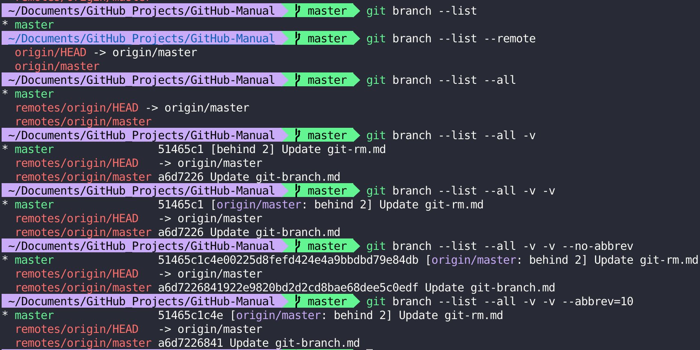

## Description

- `git branch [-v [--abbrev=<length> | --no-abbrev]] [--contains [<commit>]] [(-r | --remotes) | (-a | --all)] [--list] [<pattern>...]`

    > :heavy_check_mark: **list**

    If `--list` is given, or if there are no non-option arguments, existing branches are **listed**; the current branch will be highlighted with an asterisk.
    
    Option `-r` causes the remote-tracking branches to be listed, and option `-a` shows both local and remote branches.
    
    If a `<pattern>` is given, it is used as a shell wildcard to restrict the output to matching branches. **Note that when providing a `<pattern>`, you must use `--list`; otherwise the command is interpreted as branch creation.**

- `git branch [--set-upstream | --track | --no-track] [-l] [-f] <branchname> [<start-point>]`

    > :heavy_check_mark: **create**

    This command **creates** a new branch head named `<branchname>` which points to the current HEAD, or `<start-point>` if given.

- `git branch (-m | -M) [<oldbranch>] <newbranch>`

    > :heavy_check_mark: **rename**

   With a `-m` or `-M` option, `<oldbranch>` will be **renamed** to `<newbranch>`. If `<oldbranch>` had a corresponding reflog, it is renamed to match `<newbranch>`, and a reflog entry is created to remember the branch renaming. If `<newbranch>` exists, `-M` must be used to force the rename to happen.

- `git branch (-d | -D) [-r] <branchname>...`

    > :heavy_check_mark: **delete**

    With a `-d` or `-D` option, `<branchname>` will be **deleted**. If the branch currently has a reflog then the reflog will also be deleted.
    
    Use `-r` together with `-d` to delete remote-tracking branches. **Note, that it only makes sense to delete remote-tracking branches if they no longer exist in the remote repository or if `git fetch` was configured not to fetch them again.**

## Synopsis

- `git branch [-v [--abbrev=<length> | --no-abbrev]] [--contains [<commit>]] [(-r | --remotes) | (-a | --all)] [--list] [<pattern>...]`

- `git branch [--set-upstream | --track | --no-track] [-l] [-f] <branchname> [<start-point>]`

- `git branch (-m | -M) [<oldbranch>] <newbranch>`

- `git branch (-d | -D) [-r] <branchname>...`

## Options

- `-d, --delete`

    Delete a branch. The branch must be fully merged in its upstream branch, or in HEAD if no upstream was set with `--track` or `--set-upstream`.
    
    - `-D`
    
        Shortcut for `--delete --force`.

- `-f, --force`

- `-m, --move`

    Move/rename a branch and the corresponding reflog.
    
    - `-M`
    
        Shortcut for `--move --force`.

- `--list`

    Activate the list mode.
    
    - `-v, -vv, --verbose`
    
        When in list mode, show sha1 and commit subject line for each head, along with relationship to upstream branch (if any). If given twice, print the name of the upstream branch, as well
    
    - `--abbrev=<length>`
    
        Alter the sha1's minimum display length in the output listing. The default value is 7 and can be overridden by the `core.abbrev`
config option.
    
    - `--no-abbrev`
    
        Display the full sha1s in the output listing rather than abbreviating them.
    
    - `--contains [<commit>]`
    
        Only list branches which contain the specified commit (HEAD if not specified). Implies `--list`.
    
    - `-r, --remotes`

        List or delete (if used with `-d`) the remote-tracking branches.

    - `-a, --all`

        List both remote-tracking branches and local branches.
    
    

