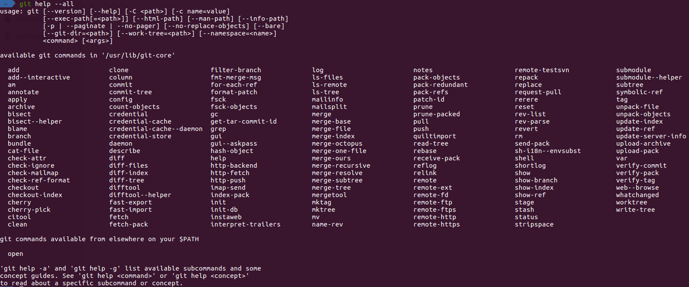
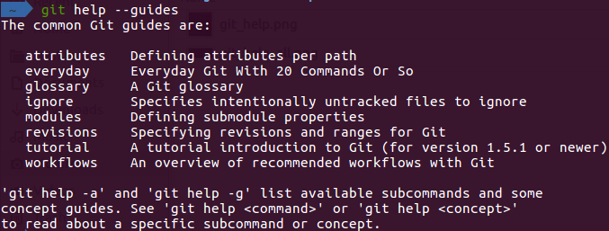

## Description

- With no options and no `COMMAND` or `GUIDE` given, the synopsis of the `git` command and a list of the most commonly used Git commands are printed on the standard output.

    

- If the option `--all` or `-a` is given, all available commands are printed on the standard output.

    

- If the option `--guide` or `-g` is given, a list of the useful Git guides is also printed on the standard output.

    

- If a command, or a guide, is given, a manual page for that command or guide is brought up. The `man` program is used by default for this purpose, but this can be overridden by other options or configuration variables.

    

## Synopsis

`git help [-a|--all] [-g|--guide] [-i|--info|-m|--man|-w|--web] [COMMAND|GUIDE]`

## Options

- `-a, --all`

    Prints all the available commands on the standard output. This option overrides any given command or guide name.

- `-g, --guides`

    Prints a list of useful guides on the standard output. This option overrides any given command or guide name.

- `[-i|--info|-m|--man|-w|--web]`

    - `-i, --info`
    
        Display manual page for the command in the **info** format. The `info` program will be used for that purpose.
    
    - `-m, --man`
    
        Display manual page for the command in the **man** format. By default the `man` program will be used to display the manual page.
    
    - `-w, --web`
    
        Display manual page for the command in the **web (HTML)** format. A web browser will be used for that purpose.
