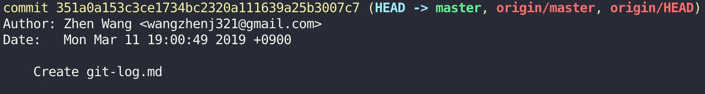
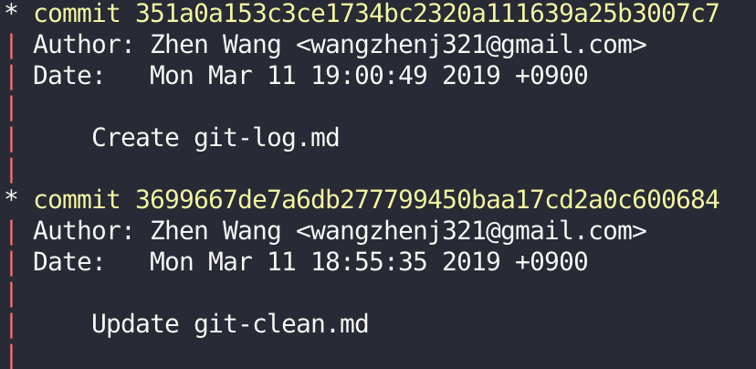

## Description

Shows the commit logs.

## Synopsis

`git log [<options>] [<revision range>] [[--] <path>...]`

## Options

- `--no-decorate, --decorate[=short|full|no]`

    Print out the ref names of any commits that are shown. If short is specified, the ref name prefixes `refs/heads/`, `refs/tags/` and `refs/remotes/` will not be printed. If full is specified, the full ref name (including prefix) will be printed. The default option is short.
    
    

- `--pretty[=<format>], --format=<format>`

    Pretty-print the contents of the commit logs in a given format, where `<format>` can be one of `oneline`, `short`, `medium`, `full`, `fuller`, `email`, `raw`, `format:<string>` and `tformat:<string>`.
    
    When `=<format>` part is omitted, it defaults to `medium`.
    
    Note: you can specify the default pretty format in the repository configuration.

- `--graph`

    Draw a text-based graphical representation of the commit history on the left hand side of the output.
    
    

- `--stat[=<width>[,<name-width>[,<count>]]]`

    Generate a diffstat. By default, as much space as necessary will be used for the filename part, and the rest for the graph part.
    
    

- `--name-only`

    Show only names of changed files.
    
    
