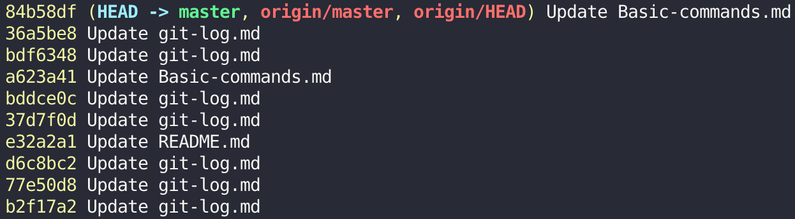
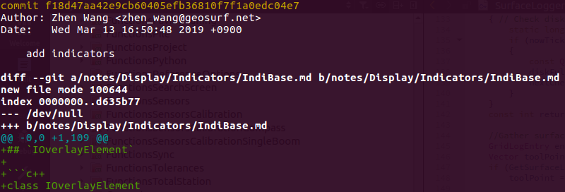

## Description

Shows the commit logs.

List commits that are reachable by following the **parent** links from the given commit(s), but exclude commits that are reachable from the one(s) given with a `^` in front of them. The output is given in reverse chronological order by default.

You can think of this as a set operation. Commits reachable from any of the commits given on the command line form a set, and then commits reachable from any of the ones given with `^` in front are subtracted from that set. The remaining commits are what comes out in the command's output. Various other options and paths parameters can be used to further limit the result.

Thus, the following command:

```
$ git log foo bar ^baz
```

means "list all the commits which are reachable from foo or bar, but not from baz".

A special notation "<commit1>..<commit2>" can be used as a short-hand for "^<commit1> <commit2>". For example, either of the following may be used interchangeably:

```
$ git log origin..HEAD
$ git log HEAD ^origin
```
    
## Synopsis

`git log [<options>] [<revision range>] [[--] <path>...]`

## Options

- `--no-decorate, --decorate[=short|full|no]`

    Print out the ref names of any commits that are shown. If **short** is specified, the ref name prefixes `refs/heads/`, `refs/tags/` and `refs/remotes/` will not be printed. If **full** is specified, the full ref name (including prefix) will be printed. The default option is short.
        
    

### Commit Limiting

- `-<number>, -n <number>, --max-count=<number>`

    Limit the number of commits to output.

- `--all`

    Pretend as if all the refs in **refs/**, along with **HEAD**, are listed on the command line as `<commit>`.

### Commit Formatting

- `--pretty[=<format>], --format=<format>`

    Pretty-print the contents of the commit logs in a given format, where `<format>` can be one of `oneline`, `short`, `medium`, `full`, `fuller`, `email`, `raw`, `format:<string>` and `tformat:<string>`.
    
    When `=<format>` part is omitted, it defaults to `medium`.
    
    > **Note: you can specify the default pretty format in the repository configuration.**
    
    - `medium`
    
        ```
        commit <sha1>
        Author: <author>
        Date:   <author date>

        <title line>

        <full commit message>
        ```

- `--abbrev-commit`

    Instead of showing the full 40-byte hexadecimal commit object name, show only a partial prefix. Non default number of digits can be specified with `--abbrev=<n>` (which also modifies diff output, if it is displayed).

- `--oneline`

    This is a shorthand for `--pretty=oneline --abbrev-commit` used together.
    
    

- `--graph`

    Draw a text-based graphical representation of the commit history on the left hand side of the output.
        
    

## Diff formatting

- `-p, -u, --patch`

    Generate patch (see section on generating patches).
    
    

- `--stat[=<width>[,<name-width>[,<count>]]]`

    Generate a diffstat. By default, as much space as necessary will be used for the filename part, and the rest for the graph part.
    
    

- `--name-only`

    Show only names of changed files.
    
    

- `-S<string>`

    Look for differences that change the number of occurrences of the specified string (i.e. addition/deletion) in a file. Intended for the scripter’s use.
    
    It is useful when you're looking for an exact block of code (like a struct), and want to know the history of that block since it first came into being: use the feature iteratively to feed the interesting block in the preimage back into `-S`, and keep going until you get the very first version of the block.
    
    Binary files are searched as well.

