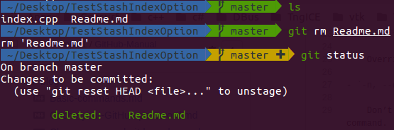
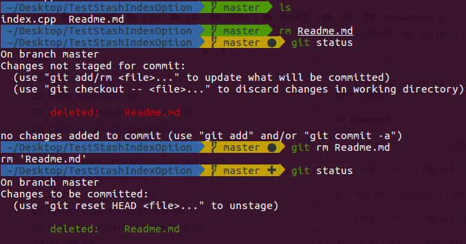
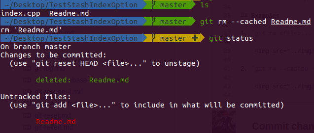
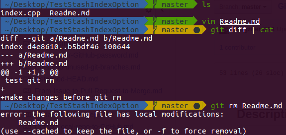

## Description

Remove files from the index, or from the working tree and the index.

> `git rm` will not remove a file from just your working directory. (There is no option to remove a file only from the working tree and yet keep it in the index; use `/bin/rm` if you want to do that.)

The files being removed have to be identical to the tip of the branch, and no updates to their contents can be staged in the index, though that default behavior can be overridden with the `-f` option. When `--cached` is given, the staged content has to match either the tip of the branch or the file on disk, allowing the file to be removed from just the index.

## Synopsis

`git rm [-f | --force] [-n] [-r] [--cached] [--ignore-unmatch] [--quiet] [--] <file>...`

## Options

- `<file>...`

    Files to remove. **Fileglobs** (e.g. `*.c`) can be given to remove all matching files. If you want Git to expand file glob characters, you may need to shell-escape them. A leading **directory** name (e.g. dir to remove dir/file1 and dir/file2) can be given to remove all files in the directory, and recursively all sub-directories, but this requires the `-r` option to be explicitly given.
    
    - `-r`
    
        Allow recursive removal when a leading directory name is given.

- `-f, --force`

    Override the up-to-date check.

- `-n, --dry-run`

    Don’t actually remove any file(s). Instead, just show if they exist in the index and would otherwise be removed by the command.

- `--`

    This option can be used to separate command-line options from the list of files, (useful when filenames might be mistaken for command-line options).

- `--cached`

    Use this option to unstage and remove paths only from the index. Working tree files, whether modified or not, will be left alone.

## Examples

1. `git rm <file>...`

    > :star: **Remove files from the working tree and the index.**
    
    
    
    - `rm <file>...` and `git add/rm <file>...` :left_right_arrow: `git rm <file>...`

        

2. `git rm --cached <file>...`

    > **Remove files from the index.**

    

3. `vim <file>...` and `git rm <file>...`

    > **The files being removed have to be identical to the tip of the branch.**
    
    
