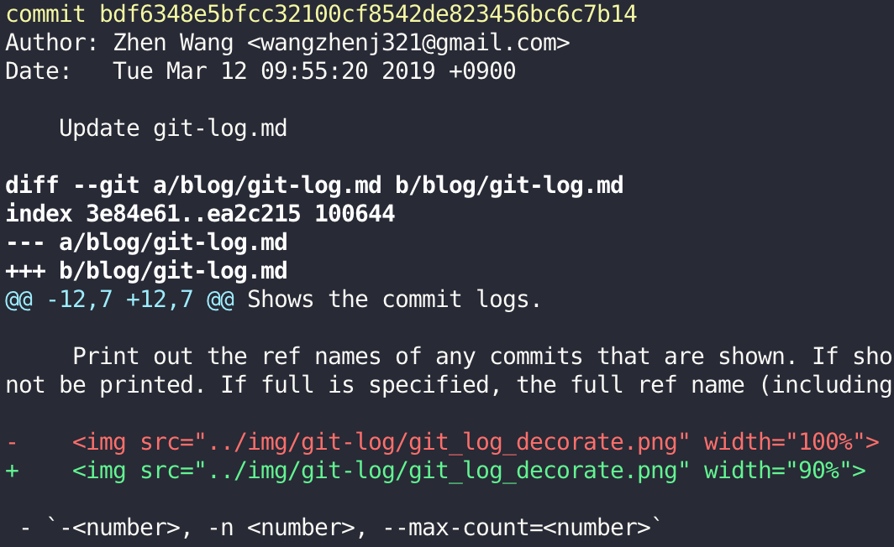
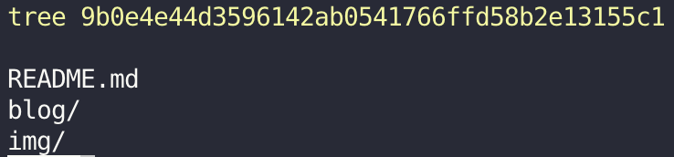

## Description

Shows one or more objects (**blobs**, **trees**, **tags** and **commits**).

- For **commits** it shows the log message and textual diff. It also presents the merge commit in a special format as produced by `git diff-tree --cc`.

    

- For **tags**, it shows the tag message and the referenced objects.

- For **trees**, it shows the names (equivalent to `git ls-tree` with `--name-only`).

    

- For **plain blobs**, it shows the plain contents.

The command takes options applicable to the `git diff-tree` command to control how the changes the commit introduces are shown.

## Synopsis

`git show [options] [<object>...]`

## Options

- `<object>...`

    The names of objects to show.

### Options applicable to [`git log`](./git-log.md)

- `--pretty[=<format>], --format=<format>`

- `--abbrev-commit`

- `--oneline`

- `--stat[=<width>[,<name-width>[,<count>]]]`

- `--name-only`
